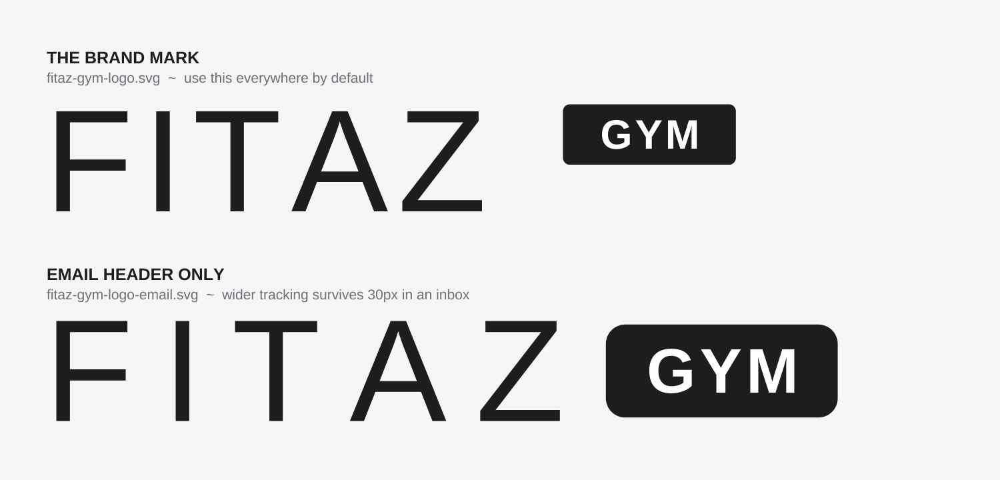

# Brand assets

Traced, self-contained versions of the FITAZ GYM lockup, in `public/brand/`.

> **These are the primary marks in use**, and an earlier trace on the
> `claude/apple-design-pass-ymnm14` branch is superseded by them. When that
> branch merges, keep the files here and drop the older trace.
>
> **But all of them are traces, not the real logo.** Karl supplied the official
> artwork on 18 August 2026 and it differs from what we have. See "The official
> logo, and how ours differs" below. The originals still need adding to
> `public/brand/source/`.

## The official logo, and how ours differs

Karl supplied the official Fitaz Gym artwork on 18 August 2026, as raster
images in a chat session. **They could not be saved into the repo from there**,
so `public/brand/source/` is still empty and everything in `public/brand/`
remains a trace built before the real mark was available.

Three differences are visible even in the raster, and two of them are things we
got wrong:

- **The GYM chip has square corners.** Ours are rounded, 4px in the email
  masthead and a radius ratio in the brand marks. The official chip is a plain
  black rectangle. This is the most obvious mismatch and the easiest to fix.
- **The letterforms are a geometric sans, not Helvetica or Arial.** The A has a
  sharp apex and the characters are wider and more evenly stroked than the
  Liberation Sans we traced from. The exact face cannot be identified from a
  raster; the source file would say.
- **Chip size and placement are close to what we have.** It sits top aligned
  against the cap line, at roughly half the cap height, which is what the
  "original" trace already does. That part holds up.

**Do not correct these by eye against the images.** Get the vector original into
`public/brand/source/` and re-trace from it. Redrawing from a JPEG to match a
JPEG is how a mark drifts twice instead of once.

### The PDF is vector, and the font is in it

Karl supplied a PDF export alongside the rasters. Reading its contents returns
the strings `FITAZ`, `GYM`, `GYM` as **live text**, not outlines. That is good
news twice over:

- **It is genuinely vector**, so a proper re-trace is possible rather than an
  approximation.
- **The typeface is embedded and named inside it.** Open the PDF in any viewer
  and look at Document Properties, then Fonts. That is the answer to the
  question these notes have been carrying since the first trace, and it takes
  about ten seconds to get.

The mark was made in Canva (`xmp:CreatorTool` says so), so the face is most
likely one of Canva's bundled fonts rather than a licensed foundry release.
Worth confirming the licence covers the uses we put it to.

**Once the font name is known**, the re-trace does not even need the PDF: the
existing tracer in the brand tooling can be pointed at the correct font file
and the marks rebuilt from real outlines.

### One of the supplied PNGs is empty. Do not use it.

The Drive file named **"Fitaz Gym Logo Black Transparent Background.png"**
(`1NhXJOkNkdNnkOuhR7kWmHXZpv__xKemi`, 1080 x 1080, RGBA, 20,061 bytes) contains
**no artwork at all**. This is not a guess from looking at it: the file was
decoded and its pixels inspected directly. Every one of the 1,035 scanlines that
could be recovered is fully transparent, alpha zero, edge to edge. Its embedded
XMP title is `GYM - 1`, and its author field says `FitazFK Gym`, so it looks
like a real export that simply rendered nothing.

The filename is the trap here. It reads like the definitive asset, so it is the
one anybody would reach for first. **Delete it at source or rename it**, because
the next person to go looking will pick it for the same reason we did.

The other supplied PNG (`1xOsEBRvRYTl0ovApzml8X2AEInwVDJ1i`, 19,333 bytes) has
not been pixel-checked yet and may have the same problem.

## Which one to use

**Use `fitaz-gym-logo.svg` unless you have a specific reason not to.** It is the
brand mark, traced from `public/logo-fitaz.svg`: tight 0.066em tracking on
FITAZ, a small GYM chip hung at the top right rather than centred.

| File | Use |
|---|---|
| `fitaz-gym-logo.svg` / `.png` | **The brand mark.** Default for everything. |
| `fitaz-gym-logo-white.svg` / `.png` | Same, reversed for dark backgrounds. |
| `fitaz-gym-logo-email.svg` / `.png` | **Email headers only.** See below. |
| `fitaz-gym-logo-email-white.svg` / `.png` | Same, reversed. |

All have a **transparent background**, so they sit on any colour. The PNGs are
1600px wide RGBA with antialiased edges, not a white box. The SVGs scale to any
size.

## Why there is a separate email mark

The email header uses a deliberately different lockup: FITAZ tracked three times
looser at 0.200em, and a chip roughly 90% of the cap height rather than 60%,
centred rather than hung at the top.

That is not a second brand. It is the same mark adjusted to survive being about
30px tall in an inbox, where the brand mark's tight tracking closes up and its
small chip stops being legible. Anywhere the mark is bigger than an email
header, the brand mark is the right one.

Do not introduce a third variant. If a new context needs something in between,
change one of these two rather than adding to the set.

## What "traced" means here

`public/logo-fitaz.svg`, the original, sets the wordmark in **live text**
(`<text>` elements asking for Helvetica Neue). That renders correctly only on a
machine that has the font. Anywhere else it silently falls back to something
else, and the letter spacing and weight shift with it.

These have the letterforms converted to **outlines**: every character is a
filled path, so there is no font to be missing and the mark is identical
everywhere. That is what makes them safe to hand to a printer, drop into a deck,
or upload to a platform you do not control.

Keep the original around. Outlines cannot be re-typeset, so if the wordmark ever
needs different spacing or a different string, edit `logo-fitaz.svg` and
re-trace rather than trying to edit the paths.

## Two things worth knowing

**The letterforms are Liberation Sans, not Helvetica Neue.** Liberation Sans is
metrically compatible with Arial, which is the last fallback in the email's font
stack and therefore what the header actually renders as for most recipients. So
these match what members see. They are **not** an exact trace of Helvetica Neue:
if you have a licensed copy and want true brand fidelity, the trace should be
redone from it. The difference is subtle at a glance and real at large sizes.

**The trace is geometric, not a scan.** The letterforms come from the font
outlines and the chip from its measured proportions, so the marks are clean at
any size. What they are not is a pixel copy of a rendered image, which means
tiny differences from `logo-fitaz.svg` as your machine renders it are expected
and are down to the font substitution above.

## Geometry

Both are built at a common FITAZ size of 120px, with chip padding, corner radius
and gap derived as ratios rather than hardcoded, so either can be rebuilt at
another size without drift. Ink is `#1d1d1f`, the same foreground token as
`src/app/globals.css`. The viewBox is trimmed to the ink with 8px of padding, so
the files carry no dead margin to fight when placing them.

The brand mark reproduces `logo-fitaz.svg`'s own ratios: GYM at 0.283 of the
FITAZ size, chip padding of 0.95 and 0.38 of the GYM size, a corner radius of
0.114 of the chip height, a gap of 0.81 of the cap height, and the chip's top
edge 0.069 of the cap height above the cap line.
